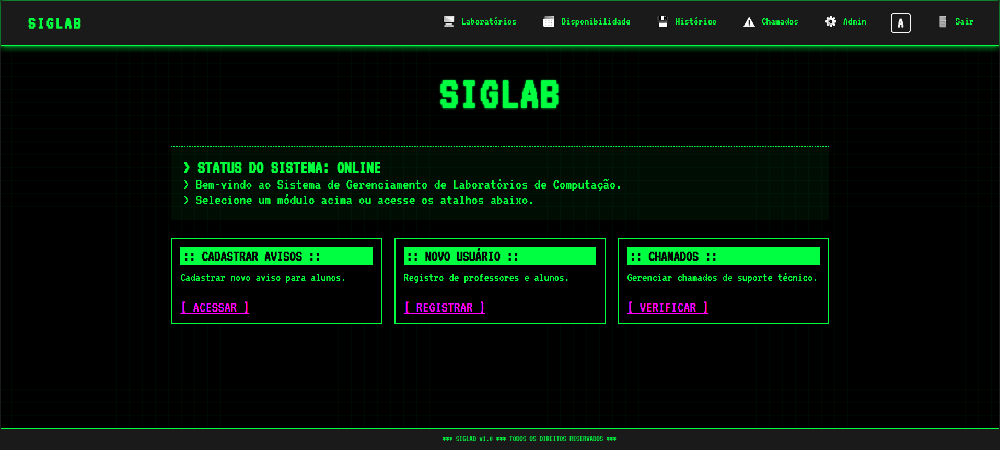
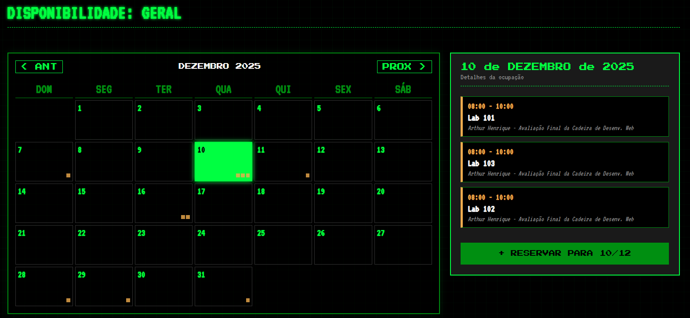
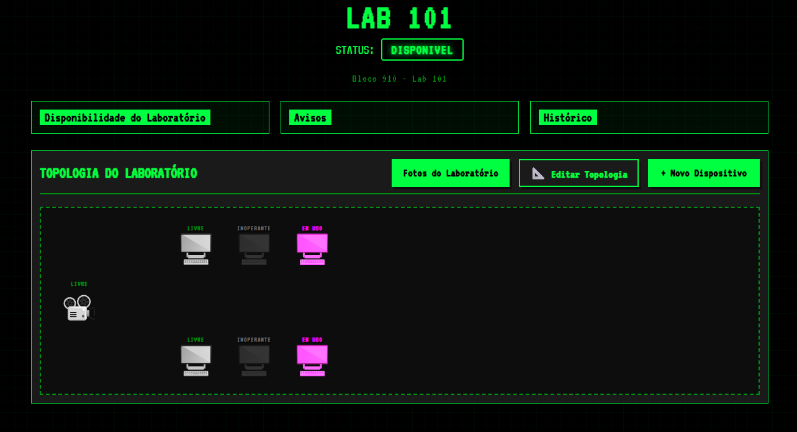
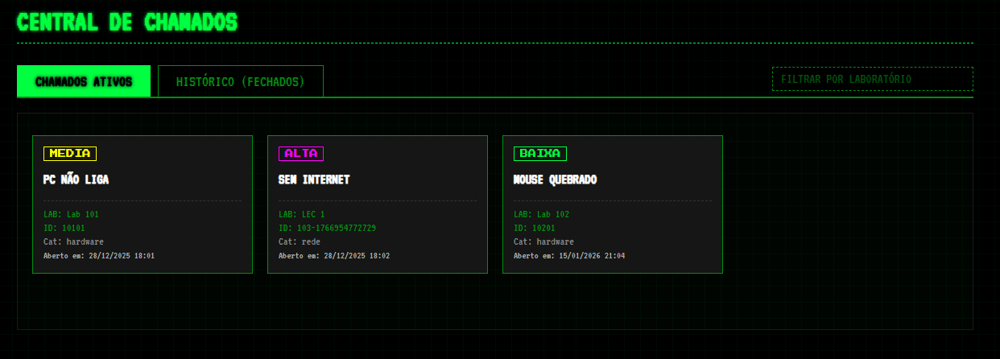

<p align="center">
  
</p>

# SIGLAB — Sistema de Gerenciamento de Laboratórios

O **SIGLAB** é uma aplicação Web desenvolvida para a disciplina de **Desenvolvimento de Aplicações para Web**, com o objetivo de facilitar o gerenciamento e o uso dos laboratórios de computação.

O sistema centraliza informações sobre laboratórios, computadores, reservas e problemas técnicos, oferecendo uma solução prática para alunos, professores e administradores.


---

## Funcionalidades

### Alunos e Professores

- Visualização do status dos laboratórios (livre, ocupado, manutenção, inativo)
- Consulta do status dos computadores (livre, ocupado, em manutenção ou inoperante)
- Registro de reportes de problemas técnicos
- Acesso ao mural de avisos do sistema

### Professores

- Reserva de laboratórios para aulas

### Administradores

- Gerenciamento de reportes e atualização de status
- Controle de hardware (laboratórios, computadores, projetores)
- Criação de Laboratórios Personalizados
- Visualização de histórico de reservas
- Gestão de usuários e avisos

---

## Como Executar o Projeto

O sistema utiliza **dois servidores Node.js** (API e aplicação Web). Cada um possui seu próprio `package.json`.

### Pré-requisitos

- Node.js instalado

### Passo a passo

1. Clone o repositório

2. Em **cada pasta do projeto** (API e Web), execute:

   ```bash
   npm i
   ```

3. Acesse no navegador:

   ```
   http://localhost:PORTA
   ```

   *(Use a porta configurada no servidor Web)*

---

## Persistência de Dados

Os dados do sistema são armazenados em **arquivos JSON**, facilitando o uso e o entendimento em ambiente acadêmico.

---


## Interface Gráfica

### Home (Administradores)


### Disponibilidade de Laboratórios


### Visualização do Laboratório


### Central de Chamados


---

📌 Projeto com fins **educacionais**, focado no aprendizado de desenvolvimento Web com Node.js.

